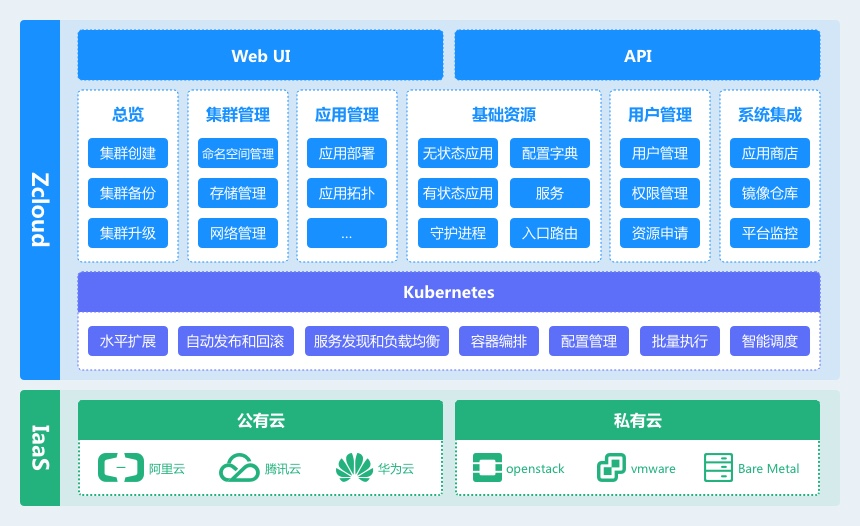

# 1      文档介绍

## 1.1         文档的目的

此文档是提供用于软件开发部门和产品设计部门、产品测试部门之间就此产品的需求分析、产品开发、产品设计、测试方案交流的基础；

## 1.2         参考文档

| **序号** | **文档名称** | **作者** | **来源**                                                     |
| -------- | ------------ | -------- | ------------------------------------------------------------ |
| 1        | 产品原型     | 王少帅   | https://lanhuapp.com/web/#/item/project/product?pid=ae53d49b-3634-4b45-86c5-602306d459b9&docId=39f5c399-104a-4781-983a-0f34a7e0d50f&docType=axure&pageId=6190da3959c241c5ba311eea7a3bd897&image_id=39f5c399-104a-4781-983a-0f34a7e0d50f |
| 2        | 产品设计     | 关倩     | https://lanhuapp.com/web/#/item/project/board?pid=ae53d49b-3634-4b45-86c5-602306d459b9&docId=39f5c399-104a-4781-983a-0f34a7e0d50f&docType=axure&pageId=6190da3959c241c5ba311eea7a3bd897&image_id=39f5c399-104a-4781-983a-0f34a7e0d50f |

 

 

## 1.3         产品命名规范

| **产品名称Zcloud** |          |      |
| ------------------ | -------- | ---- |
| 中文名称           | 英文名称 | 备注 |
|                    |          |      |
|                    |          |      |

 

# 2      产品介绍

## 2.1         产品概要说明

Zcloud是基于容器技术的企业级云平台解决方案。结合Kubernetes对企业的物理机、虚机等资源进行统一管理。对企业的应用做统一调度。保证企业的IT系统或门户网站实现高可用、可扩展、易于发布等特性。

结构图如下：

* 全局：列出平台所有纳管的集群，并可删除、创建、编辑集群，展示平台的全局配置。
* 集群管理：对集群的资源使用情况，集群命名空间、节点、存储、网络资源管理。
* 容器管理：对集群的容器运行时进行监控与保活，对于各容器使用的镜像进行管理。
* 应用商店：对平台支持的应用模版进行说明展示。
* 应用管理：以命名空间为维度进行资源监控展示，对已安装的应用进行管理，并进行应用相关资源的拓扑展示。
* 基础资源：对k8s的原生资源进行管理。
* 资源申请：普通用户进行资源配额的申请，管理员进行资源申请的审批
* 镜像仓库：跳转到镜像仓库页面
* 监控中心：跳转到监控中心页面

 

## 2.2         产品用户定位

此产品面向的主要是两类人员。一类是面向系统的运维人员，另一类是面向开发人员。因产品所包含的知识面非常广，同时也很专业，所以产品设计和实现时尽量给予简单的界面和完备的帮助，并对重要功能的业务权限要集中、重点控制。

 

## 2.3         产品中的角色

| **角色名称** | **职责描述**                                                 | **使用的功能**                   | **权限等级** |
| ------------ | ------------------------------------------------------------ | -------------------------------- | ------------ |
| 系统管理员   | 对权限进行划分，管理后台用户，对用户进行资源分配，维护基础资源可用。 | 全部                             | 1            |
| 普通用户     | 对权限内的资源有使用权。可维护自行创建的服务等。             | 只能使用指定namespaces下的资源。 | 2            |

 

# 3      产品角色权限

* **管理员（所有功能）**：

1、  集群列表

2、  用户

3、  资源审批

4、  集群管理

5、  镜像仓库

6、  集群监控

* **普通用户（集群层中的命名空间层）**：

1、  应用商店（所有集群的命名空间看到的内容一致）

2、  应用管理

3、  基础资源

4、  资源申请

5、  登录用户下拉菜单中，不包含用户列表

6、  集群监控

# 4      产品功能结构图

* 全局
  * 集群列表
  * 全局配置
* 集群管理
  * 概况
  * 命名空间
  * 节点
  * 存储
  * 网络
* 容器管理
  * 容器监控
  * 镜像管理
* 应用商店
  
  * 本地应用模版
* 应用管理
  * 物理资源
  * 应用列表
  * 应用拓扑
* 基础资源
  
  * 无状态副本、有状态副本、守护进程、定时任务、任务、服务、服务入口、配置字典、保密字典
* 资源申请
  
  * 申请列表
  
* 用户管理
  
  * 用户创建、删除、编辑
* 镜像仓库（跳转）
* 监控中心（跳转）

 

 

# 5      功能需求

## 5.1         导航栏

### **5.1.1**    功能原型

*参见1.2* *参考文档*

### **5.1.2**    功能概述

对全局性的功能进行操作，包含菜单导航收缩、菜单导航、集群选择、命名空间选择、集群命令行、通知、帮助、用户功能列表。

### **5.1.3**    功能(业务)流程图

无

### **5.1.4**    功能点清单

* 导航栏
  * 导航收缩
  * 菜单导航
    * 全局、集群管理、容器管理、应用商店、应用管理、基础资源、资源申请、镜像仓库、监控中心
  * 集群选择
  * 命保空间选择
  * 集群命令行
  * 通知
  * 帮助
  * 用户功能列表 

### **5.1.5**    功能详细描述

导航栏收缩：控制导航栏收起或展开，收起时只留图标，展示开显示图标加文字。

菜单导航：这里只包含两种逻辑，没有选择集群和已选择集群。当没有选择集群时，只显示总览与资源申请。当选择集群后，要显示所有菜单。

集群选择：下拉菜单，列出该用户权限内的所有集群。

命名空间选择：下拉菜单，列出该用户权限内的所有命名空间。

集群命令行：只有选择集群后，此按钮才可用。为了方便用户在任何操作页面可以随时进入集群命令行设计。

通知：zcloud产生的通知，为集群产行的告警等消息。

帮助：zcloud使用帮助手册。

用户功能：用户编辑、用户详情、修改密码、用户列表、注销。

### **5.1.6**    业务数据描述

1、角色信息（角色名称、角色描述）

角色名称：20个英文字符

角色描述：50个中文字符

角色权限：复选框选择

 

2、用户信息（用户名、备注、集群权限）

​        用户名： 由字母a～z(不区分大小写)、数字0～9、点、减号或下划线组成。只能以数字或字母开头和结尾 用户名长度为4～20个字符。

​        登陆密码：6到16个字符。机器生成

 

## 5.2         全局

### **5.2.1**    原型

*参见原型地址。*

### **5.2.2**    功能概述

展示所有已被zcloud纳管的集群列表。

 

### **5.2.3**    功能点清单

* 集群一级操作

  - 展示集群
  - 创建集群
  - 删除集群

* 集群二级操作

  - 集群命令行

  - 取消操作

  - 安装日志

  - 添加节点

  - 删除节点 

* 全局配置

### **5.2.4**    功能详细描述

#### **5.2.4.1**      集群列表

**功能点描述：** 对zcloud已纳管的集群做概要的信息展示。

**使用角色：** 管理员。

具体展示字段，集群状态、集群名称、节点数、CPU使用与总量、内存使用与总量（单位放在表头）、容器数使用与总容量、kubernetes版本、操作（命令行、重新部署、删除、查看安装日志、编辑）

可通过集群名称进行搜索过滤。

集群整个生命周期内，所有状态的转换关系图。

#### **5.2.4.2**      创建集群

**功能点描述：** 进行集群的创建。

创建参数如下：

集群属性设置：集群名称，集群域名后缀。

Zke设置：zcloud服务IP，zcloud服务端口。

SSH设置：用户名，ssh私钥文件，ssh连接端口。

集群网络设置：服务IP段，POD IP段，flannel或是calico，集群内部DNS IP，转发DNS IP。

私有仓库设置：URL，CA证书，用户名，密码。

添加节点设置：主机名，IP，角色（master和etcd与其它角色互斥）

**使用角色：** 管理员。

**描述**

创建集群时，集群状态初始为creating，若创建成功（zcloud可正常访问api server），则集群状态变为running。只有running状态下，才可以选择集群，进行其它操作。若失败，集群状态为unavailable。

#### **5.2.4.3**      删除集群

**功能点描述：** 对集群进行删除操作。

**使用角色：** 管理员。

删除zcloud的集群记录，zcloud记录的集群资源要关联删除。

集群删除：在unreachable，running，unavailable状态下可以操作删除集群。

#### **5.2.4.4**      集群操作

**功能点描述：** 对集群进行管理操作。

**使用角色：** 管理员。

在集群管理功能中，用户可以对集群的状态进行管理，在创建中、更新中、连接中状态可以进行终止操作。并且可以查看集群的属性字段。可以对集群的节点进行添加或删除的操作。

各种状态下，可进行的操作如下：

运行中：命令行-可使用，停止与日志不可使用

不可用：命令行、停止不可使用

更新中：命令行不可使用、停止与日志可用

连接中：命令行不可全叻、停止可用，日志不可使用

创建中：命令行不可使用、停止与日志可用

不可达：命令行、停止与日志不可使用

#### **5.2.4.5**      删除节点

**功能点描述：**  删除集群节点。

删除节点：支持批量删除

**使用角色：** 管理员。

**描述**

删除节点实际上是对集群的update操作，当节点变动时，集群状态会有两种结果running - updating - running成功，这时查看节点数会相应的减少。running - updating -unavailable失败。在etcd良好运行的情况下，删除操作不会失败。

running与unavailable状态的集群才允许做删除节点。

若集群只剩余一个master节点，则不允许删除master节点；

若集群只剩余一个etcd节点，则不允许删除etcd节点；

若集群只剩余一个worker节点，则不允许删除workder节点；

master节点与etcd节点，只允许增加，不允许删除。后续版本再考虑master与etcd节点的删除操作。

#### **5.2.4.6**      添加节点

**功能点描述：** 添加集群节点。

添加节点设置：主机名，IP，角色（master和etcd与其它角色互斥）

**使用角色：** 管理员。

**描述**

添加节点实际上是对集群的update操作，当节点变动时，集群状态会有两种结果running - updating - running成功，这时查看节点数会相应的减少。running - updating -unavailable失败。如果发生失败，添加的节点信息保存在集群配置里。并且节点数量不会变。

#### **5.2.4.7**      进入集群命令行

**功能点描述：** 进入集群的命令行，进行信息的查看操作。

**使用角色：** 所有具有该集群权限的用户

**描述**

只有running状态下的集群才可用，进入命令行后，用户只有只读权限。

#### **5.2.4.8**      终止操作

**功能点描述：** 对集群的创建或更新动作进行取消。

**使用角色：** 管理员。

**描述**

creating，updating，connecting状态可进行取消操作。

#### **5.2.4.9**      查看创建或更新日志

**功能点描述：** 查看创建或更新日志

**使用角色：** 管理员。

**描述**

仅creating和updating状态可查看创建/更新日志。日志缓存50条。当创建或更新失败或完成后，日志功能不可用。

#### **5.2.4.10**      全局配置

**功能点描述：** 启用监控、镜像仓库

**使用角色：** 管理员

**描述**

监控：

镜像仓库： 

#### **5.2.4.11** 集群修改

只有处于失败状态的集群才允许修改。可修改的字段属性如下：

ssh用户名、ssh端口、ssh私钥

### **5.2.5**    业务数据描述

1、新建集群信息

集群名称：20位中文字符或英文字符

## 5.3         集群管理

### **5.3.1**    功能原型

*参见原型地址。*

### **5.3.2**    功能概述

对集群的资源使用和基本信息进行展示，维护集群的节点资源与命名空间资源。

### **5.3.3**    功能点清单

* 概览
  * 展示集群创建信息、资源使用
* 命名空间
  * 展示列表、命名空间详情、新建、删除，命名空间的编辑指的是编辑资源配额
* 节点
  * 节点列表、名称，状态，容器版本，CPU，MEM，POD，节点详情，节点的增加与删除在集群编辑页面
* 存储
  * 集群的存储管理，本地存储，网络存储，增加删除更改。
* 网络
  * 展示网络信息与IP使用情况

 

### **5.3.4**    功能详细描述

#### **5.3.4.1**      概览

集群信息：展示集群名称、k8s版本号、部署本集群的zcloud版本号，节点数、创建时间。

资源信息： CPU使用情况、MEM使用情况、Pods使用情况。

#### **5.3.4.2**      命名空间

命名空间需要有创建功能、删除功能与编辑功能。

创建：创建命名空间时，需要输入资源配额一起进行创建。

删除：删除命名空间时，所属资源全部清空。

编辑：编辑命名空间时，只允许编辑资源配额的数值。命名空间名称不可以修改。

#### **5.3.4.3**      节点

展示本集群内，所有节点的列表。并且列表页显示节点名称，节点的状态，IP地址，角色，标签，创建时间。在此页面，不允许增加、删除、编辑。只允许查看节点详情。

详情页面显示属性如下：

节点名称、IP地址、角色、Docker版本、操作系统、内核版本、创建时间、cpu、mem、pods。

**操作**

cordon：停止调度
uncordon：恢复调度

drain：驱逐所有POD

集群内节点需要支持以上三种操作。用来排查问题，或对节点进行维护。使用本地存储的，也要支持这个原则。节点维护CPU、MEM时使用。

#### **5.3.4.4**      存储

存储列表页需要显示存储名称，存储状态，类型，包含的节点，总大小，已分配，未分配。

存储支持两种类型：本地存储（lvm），网络存储（ceph）。创建的存储列表只能创建两条。

**创建**

Storageclass名称与存储集群名称一致。用户选择当前集群可用的带有存储的节点加入到存储集中。对于可用的定义如下：节点有块设备，块设备没有文件系统，块设备没有被zcloud存储使用，块设备为空设备，满足以上所有条件，该节点才是可用的。

目前需要支持本地存储（lvm），网络存储（ceph），创建时指定类型。

**删除**

删除存储的storageclass时，需要检测是否有POD正在使用，若有POD正在使用，设置垃圾回收，并对用户做友好性提示。

**查看**

本地存储（lvm）：在详情页中，展示所有节点与pvc，当单击某一个节点的时候，只显示当前节点的pvc。管理员能看到存储使用情况的统计数据。

网络存储（ceph）：在详情页中，展示所有节点与pvc，不支持按节点对pvc进行过滤。管理员能看到存储使用情况的统计数据。

**编辑**

编辑存储时，可以删除也可以增加。删除节点如果是ceph，时间会比较长。需要展示存储集的相应状态。

**状态**

对于存储资源，状态变动的有两种情况：创建、更新。某一个块设备异常只有事件，存储的状态不应该受影响。存储在创建时状态变化比较多，用文字显示。更新时存储集群显示更新即可，具体每一个块设备的状态待后续开发。

**PVC扩容**

当为workload创建pvc之后，pvc支持容量的扩容操作。存储类型不可变更，pvc扩容只允许在可用的存储空间内自定义大小。只允许增加，不允许减少。

#### **5.3.4.5**      网络

展示集群的网络信息，类型、地址段等。并且展示集群每个node的IP使用情况。

POD IP：分为列表页与详情页两层。

列表页按节点划分元素。显示节点名称、POD网段、地址总数、已使用地址数、未使用地址数。别且支持展示详细的使用情况。某一个IP被哪个POD使用了。

如果POD使用的是主机的IP，需要在每一个元素展开式，进行单独的展示。POD名称，POD端口。

服务IP：展示此集群创建的所有服务。显示服务名称与IP即可。

### **5.3.5**    业务数据描述

命名空间名称：自定义名称-前6位sha256(username)

## 5.4  容器管理

### **5.4.1**    功能原型

*参见原型地址*

### **5.4.2**    功能概述

### **5.4.3**    功能点清单

* 容器监控
* 镜像管理 

### **5.4.4**    子功能详细描述

#### **5.4.4.1**      容器监控

#### **5.4.4.2**      镜像管理

### **5.4.5**    业务数据描述

## 5.5      应用商店

### **5.5.1**    功能原型

*参见原型地址*

### **5.5.2**    功能概述

​		Helm 是 Kubernetes 生态系统中的一个软件包管理工具。而Chart是helm管理应用的打包格式，一个chart对应一个或一套应用。内部是一系列的yaml描述文件，以及为yaml 服务的文件。很多的chart聚集在一起，对于用户就是一个一个的应用模版，用户可以使用这些模版快速的部署应用服务。

​		此功能涉及的资源类型：

- chart资源：chart资源提供chart的信息展示，配置展示等。在chart的详情页面可以进行app资源的创建。

​		chart资源没有父资源，也没有子资源。chart本身是独立的。

### **5.5.3**    功能点清单

- chart资源
  - 云端下载
  - 本地加载

### **5.5.4**    子功能详细描述

#### **5.5.4.1**  云端下载

​		下载chart不需要认证，且使用chart已安装的app资源不支持版本更新。直接使用helm协议进行异步下载。

​		zcloud轮询更新chart，间隔1分钟。

​		使用harbor进行chart管理，支持上传新的chart，支持上传某一个chart的新版本。harbor会重新组织所以文件。当harbor有更新时，zcloud需要在1分钟的范围内发现更新并进行下载。

​		chart页面不需要刷新，当用户再次进入页面或刷新时，才能看到新的chart。

​		下载，对比，完成需要有日志，供测试使用。

​		chart更新完成后，可立刻使用进行app资源的安装，无需更新zcloud版本。

#### **5.5.4.2**  本地加载

​		已下载的chart资源保存在本地，Zcloud启动时，是把chart资源加载到内存，还是每一个URL请求时实时在本地获取，开发自行定义。当访问Zcloud UI时，对chart资源列表进行展示， 展示内容：icon，chart名称，描述，详情按钮。		

### **5.5.5**    业务数据描述

此功能操作的范围：只有选择某一个集群时，应用商店才可见。

chart资源没有父资源，也没有子资源。chart本身是独立的。

## 5.6         应用管理

### **5.6.1**    功能原型

*参见原型地址*

### **5.6.2**    功能概述

查看当前命名空间的资源使用情况，对使用应用模版创建的应用进行管理，对已安装的应用做探测展示，列出所有相关联的资源。

- app资源：包含一个或多个k8s资源。需要在指定的namespaces进行创建。

此功能操作的范围：app资源的安装和卸载只能在namespaces下操作。

​		app资源的父资源是namespaces，如果删除namespaces，app资源也需要一起删除。app资源包含k8s的资源为引用关系。若app资源删除，在业务逻辑上，需要删除相关引用的k8s资源。

### **5.6.3**    功能点清单

* 物理资源
* 应用列表
  * 创建、展示、删除
* 应用拓扑

### **5.6.4**    子功能详细描述

#### **5.6.4.1**      物理资源

 此功能展示用户空间内的物理资源使用情况，包含CPU、MEM、POD数。采集频率为30秒。

CPU：计算用户空间内已使用CPU的总和，并与集群总体CPU资源做百分比。显示top5的POD，显示内容为pod名称，workload名称，CPU使用。按CPU由高到低排序。workload名称具有跳转到详情的功能。

MEM：计算用户空间内已使用MEM的总和，并与集群总体MEM资源做百分比。显示top5的POD，显示内容为pod名称，workload名称，MEM使用。按MEM由高到低排序。workload名称具有跳转到详情的功能。

POD数：显示用户空间内使用的pod资源占集群总POD资源的百分比。

#### **5.6.4.2**      应用列表

**创建**

- 当创建app资源时，需要根据app资源预设的属性进行设置后，再进行创建。
- 因我们规定，app资源的创建必须在指定的namespaces下进行，所以需要对chart进行检测，不允许chart进行namespaces的创建操作。
- 同一个chart资源，在同一个namespaces下，可以允许app资源多次创建，需要指定不同的k8s资源名称。
- 当app资源需要使用存储时，不必须开放pv与pvc的配置，让用户添加存储名称，类型，大小即可。pv与pvc在Zcloud帮助用户进行创建。
- 状态机如下图

**app资源展示**

对已创建的app资源进行展示，并且可以按来源chart进行分组，清晰的定义哪些app资源是从同一个chart进行创建的，这里不需要细化到版本，只细化到chart的名称即可。

- app资源展示的概要内容如下：icon，app资源名称，删除时间，创建时间，app资源URL；
- 可进行的操作如下：升级、降级、删除。
- 先按时间排序

​        对于app资源，需要接口返回app资源里引用的k8s资源。对于k8s资源的修改，目前不再单独做。先跳转到已有的应用管理进行修改。减少代码工作量。app资源详情页中，k8s资源只返回name，kind，link

​        对于k8s资源，目前只显示deployment、statefulset、daemonset，cronjob，job，config map，secret，svc，ingress，不显示pvc，pv，serviceaccount，clusterrole，clusterrolebingd，networkpolicy。

​		svc，ingress，与deployment等关系不做保存。

**app资源的子资源状态**

在app资源列表中，需要显示workload（deployment,statefulset,daemonset）的总数与ready数。例如一个app资源包含一个deployment，2个statefulset，那么app资源显示的子资源总数为3，当一个workload状态变成ready后，app子资源的ready数加1。

**删除**

​		支持一键删除已安装的app资源。删除app资源时，其所有引用的k8s资源全部要关联删除。如果app资源所有的namespaces被删除，那么app资源也要被删除。

​		删除时，需要定义删除时间，前端显示删除状态。

#### **5.6.4.3**      应用拓扑

### **5.6.5**    业务数据描述

## 5.7         基础资源管理

### **5.7.1**    功能原型

*参见原型地址*

### **5.7.2**    功能概述

对集群的workload进行管理，无状态副本（deployment）、有状态副本（statefulset）、守护进程集（deamonset）、定时任务（cronjob）、任务（job）、配置字典（configmap）、保密字典（secret）、服务（service）、服务入口（ingress）、UDP服务入口（udp_ingress）。

### **5.7.3**    功能点清单

* 无状态副本
  * 副本展示
  * 副本删除
  * 副本新建
  * 增加POD个数
  * 升级与回滚
* 有状态副本
  - 副本展示
  - 副本删除
  - 副本新建
  - 增加POD个数
  - 升级与回滚
* 守护进程集
  - 进程集展示
  - 进程集删除
  - 进程集新建
  - 升级与回滚
* 定时任务
  - 任务展示
  - 任务删除
  - 任务新建
  - 增加POD个数
* 任务
  - 任务展示
  - 任务删除
  - 任务新建
* 服务
  * 服务展示
  * 服务创建
  * 服务删除
* 服务入口
  - 入口展示
  - 入口创建
  - 入口删除
* UDP服务入口
  - 入口展示
  - 入口创建
  - 入口删除
* 配置字典
  * 配置展示
  * 配置创建
  * 配置删除
  * 配置修改
  * 自动加载
* 保密字典
  - 保密字典展示
  - 保密字典创建
  - 保密字典删除
  - 保密字典修改
  - 自动加载 

### **5.7.4**    子功能详细描述

所有deployment，statefulset，daemonset需要支持pod重启功能。应对有问题的POD进行初始化操作。

#### **5.7.4.1**      无状态副本

**创建**

deployment创建需要支持以下设置：

1、存储设置

2、环境变量设置

3、保密字典设置

4、配置字典设置

5、容器设置

6、负载均衡需要支持会话保持设置

**列表页**

显示deployment的概要信息，名称、子资源状态、副本数、创建时间

子资源状态定义如下：deployment readyReplicas/replicas

**详情页**

展示创建时的输入，展示子资源的POD列表。

**操作**

升级、回滚、删除。

**修改**

启动命令，启动参数，镜像，环境变量，存储挂载路径，保密字典挂载路径，配置字典挂载路径

#### **5.7.4.2**      有状态副本

**创建**

statefulset创建需要支持以下设置：

1、存储设置

2、环境变量设置

3、保密字典设置

4、配置字典设置

5、容器设置

6、负载均衡需要支持会话保持设置

**列表页**

显示statefulset的概要信息，名称、子资源状态、副本数、创建时间

子资源状态定义如下：statefulset readyReplicas/replicas

**详情页**

展示创建时的输入，展示子资源的POD列表。

**操作**

升级、回滚、删除。

**修改**

启动命令，启动参数，镜像，环境变量，存储挂载路径，保密字典挂载路径，配置字典挂载路径

#### **5.7.4.3**      守护进程集

**创建**

daemonset创建需要支持以下设置：

1、存储设置

2、环境变量设置

3、保密字典设置

4、配置字典设置

5、容器设置

6、负载均衡需要支持会话保持设置

**列表页**

显示daemonset的概要信息，名称、子资源状态、副本数、创建时间

子资源状态定义如下：daemonset numberReady/desiredNumberScheduled

**详情页**

展示创建时的输入，展示子资源的POD列表。

**操作**

升级、回滚、删除。

**修改**

启动命令，启动参数，镜像，环境变量，存储挂载路径，保密字典挂载路径，配置字典挂载路径

#### **5.7.4.4**      定时任务

#### **5.7.4.5**      任务

#### **5.7.4.6**      服务

**负载均衡**

增加会话保持设置。

#### **5.7.4.7**      服务入口

**修改**

域名和路径

#### **5.7.4.8**      UDP服务入口

**修改**

端口

**负载均衡**

增加负载均衡设置

#### **5.7.4.9**      配置字典

#### **5.7.4.10**      保密字典

 

### **5.7.5**    业务数据描述

### 

 

## 5.8         资源申请

### **5.8.1**    功能概述

在平台中，资源申请为一种资源对像。此对像没有父资源，相关联的k8s资源为命名空间。普通用户只能通过此项功能进行资源的申请。用户申请的资源需要经过管理员审核通过后才可使用。

### **5.8.2**    功能点清单

* 资源申请查询
* 资源申请新建
* 资源申请祥情
* 资源申请删除
* 资源申请审批 

### **5.8.3**    功能详细描述

#### **5.8.3.1**      资源申请查询

**功能点描述：** 普通用户：展示该用户所有的申请记录，管理员：展示平台内所有的申请列表。

**使用角色：** 管理员、普通用户。

已批复的资源申请，如需调整，需要在原有记录再次调整。处于驳回或审核中的记录不允许删除、调整。

#### **5.8.3.1**      资源申请新建

**功能点描述：** 用户通过此功能，向管理员申请使用平台内的资源。

**使用角色：** 普通用户。

资源申请新建时，在用户添写命名空间后添加6个字符的sha256(username)值，开始的6个字符。例如web-7a49bc。中间需要添加中划线分隔。

#### **5.8.3.1**      资源申请详情

**功能点描述：** 普通用户使用该功能时，看到的是申请的所有信息详情页，包含拒绝原因等内容。

**使用角色：** 普通用户、管理员。

#### **5.8.3.1**      资源申请删除

**功能点描述：** 删除资源申请记录、此动作同时会清理用户已申请的命名空间。

**使用角色：** 管理员。

正在审核的申请不允许删除，驳回、审核通过的记录才可以删除。删除申请记录时，会联动删除该命名空间。

#### **5.8.3.1**      资源申请审批、驳回

**功能点描述：** 管理员对用户的资源申请进行审核，审核通过后，平台需要联动创建相应的命名空间与ResourceQuota。若是驳回请求，则后台资源不做任何变动。若驳回的是调整的申请，则申请记录状态变成已驳回。

**使用角色：** 管理员。

### **5.8.4**    业务数据描述

## 5.9  用户管理

### **5.9.1**    功能概述

平台用户的管理，可以创建、删除、编辑。对用户的权限进行管理。 

### **5.9.2**    功能点清单

* 用户创建
* 用户删除
* 用户编辑
* 密码修改 

### **5.9.3**    功能详细描述

#### **5.9.3.1**      用户创建

**功能点描述：** 创建平台普通用户，并设置密码与用户权限。

**使用角色：** 管理员。

#### **5.9.3.2**      用户删除

**功能点描述：** 删除平台用户，用户相关资源不做处理。

**使用角色：** 管理员。

#### **5.9.3.3**      用户编辑

**功能点描述：** 此功能只能修改用户所以集群权限，其它属情字段待进一步总结需求后再给出。

**使用角色：** 管理员。

#### **5.9.3.3**      密码修改

 **功能点描述：** 管理员使用此功能只能直接重置用户的密码，普通用户使用此功能只能做修改密码操作。

**使用角色：** 管理员、普通用户。

### **5.9.4**    业务数据描述

 系统管理

## 5.10 镜像仓库

### 5.10.1    功能概述

此功能为系统中间件。登录的默认帐号是admin，密码是zcloud。安装镜像仓库，使用户拥有镜像管理的能力。目前不支持帐号关联自动登录。CA证书在集群节点安装docker时就内置到系统中。此功能位于集群资源下。此功能需要有状态处理，并且不支持删除。

镜像仓库在某一个集群内部安装即可，不需要所有集群全部安装。

### **5.10.2**    功能点清单 

1、安装

2、跳转

### **5.10.3**    功能详细描述

#### **5.10.3.1**      安装

需要指定存储大小和访问域名进行安装。安装过过程中，需要有状态处理，比如处于安装状态，用户再次电击，需要有相应的交互。涉及的状态如下：安装中，已完成，安装失败。

#### **5.10.3.2**      跳转

当处于安装完成状态时，用户再次单击此菜单，直接做页面跳转。

### **5.10.4**    业务数据描述

## 5.11 监控中心

### 5.11.1    功能概述

此功能为系统中间件。默认用户名admin，密码zcloud。监控中心是Zcloud所管理集群的监控平台。需要Zcloud管理的每一个集群都进行安装。安装后不可卸载，只能跳转使用。默认集成etcd、节点的监控。

### **5.11.2**    功能点清单 

1、安装

2、跳转

### **5.11.3**    功能详细描述

#### **5.11.3.1**      安装

所有参数都是默认，提供便捷的安装流程。需要有状态处理：安装中，已完成，安装失败。

#### **5.11.3.2**      跳转

当处于安装完成状态时，用户再次单击此菜单，直接做页面跳转。

## 5.12 日志中心

### 5.12.1    功能概述

此功能为系统中间件。默认用户名admin，密码zcloud。集成ELK日志与分析系统。

### **5.12.2**    功能点清单 

1、安装

2、跳转

### **5.12.3**    功能详细描述

#### **5.12.3.1**      安装

支持设置存储大小，提供便捷的安装流程。需要有状态处理：安装中，已完成，安装失败。

#### **5.12.3.2**      跳转

当处于安装完成状态时，用户再次单击此菜单，直接做页面跳转。

### **5.12.4**    业务数据描述

## 5.13 Zcloud预警

### 5.13.1    功能概述

 event事件过滤，需要聚合。

### **5.13.2**    功能点清单 

### **5.13.3**    功能详细描述

#### **5.13.3.1**      预警

#### **5.13.3.2**      

### **5.13.4**    业务数据描述

# 6  非功能性需求

## 6.1界面操作需求

整体风格保持一致，功能操作使用按钮，操作在同一界面上完成。

兼容800X600以及以上各分辨率。

## 6.2性能需求

同时支持50个集群的管理，单集群支持1000个节点。

## 6.3安全性需求

高级管理员与普通用户以权限划分不同的操作资源。

## 6.4维护与升级

## 6.5可靠性和健壮性

## 6.6用户文档需求

## 6.7运行环境

浏览器Firfox、chrome

 

 

 

 

 
