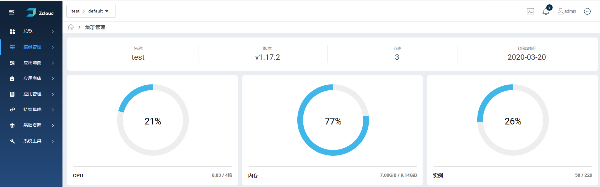

# 1 概述

Zcloud采用web方式进行管理，所有设置均通过web页面完成操作。地址为<u>https://<IP></u>，缺省管理用户名和密码为admin/zcloud。

## 1.1 场景一

## 1.2 场景二

# 2 titlebar

## 2.1 选择用户空间

## 2.2 命令行

## 2.3 平台告警

## 2.4 用户管理

## 2.5 平台事件

# 3 导航栏

## 3.1 菜单缩进

## 3.2 菜单项

管理员、普通用户操作差别说明

# 4 总览

## 4.1 集群列表

## 4.2 全局配置

## 4.3 操作日志

# 5 集群管理

## 5.1 集群概览

## 5.2 用户空间

## 5.3 节点

## 5.4 存储

## 5.5 网络

# 6 应用地图

## 6.1 资源概览

## 6.2 服务网格

## 6.3 应用拓扑

## 6.4 实时流量

# 7 应用商店

## 7.1 我的应用

## 7.2 系统应用

# 8 应用管理

## 8.1 应用列表

## 8.2 弹性伸缩

# 9 持续集成

## 9.1 工作流

# 10 基础资源

## 10.1 服务

## 10.2 HTTP入口

## 10.3 UDP入口

## 10.4 配置字典

## 10.5 保密字典

## 10.6 无状态副本

## 10.7 有状态副本

## 10.8 守护进程

## 10.9 定时任务

## 10.10 任务

## 10.11 存储卷

# 11 系统工具

## 11.1 镜像仓库

## 11.2 监控中心

## 11.3 日志分析

