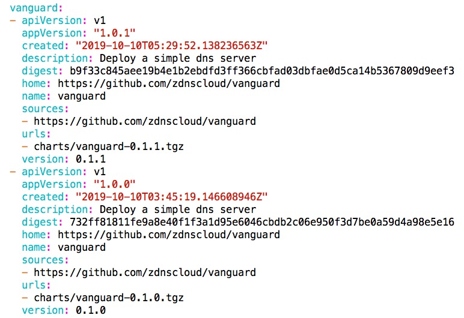

# 云商店
## 参数
-repo 云商店的url

## 业务流程
每间隔1分钟从云商店获取所有chart信息，检查本地charts确认是否需要从云商店下载，具体流程如下：

* 设置http ResponseHeaderTimeout为1分钟，即http请求的response header的超时时间为1分钟，超时则报错并结束本次循环。
* 获取云商店index.yaml文件，index.yaml文件存放所有chart信息，数据结构为chart名字对应chart版本信息的数组，例如vanguard chart在index.yaml文件的信息如下：

  由图可以看到vanguard chart有两个版本，每个版本信息中都包含这个版本对应chart压缩包的urls。
  
* 获取本地charts信息，即读取本地charts文件目录，获取到所有的charts及其版本信息
* 依次检查index.yaml中chart是否在本地已存在
  * 如果chart在本地已经存在，检查index.yaml中此chart的每个版本是否在本地已存在，如果不存在就从云商店中将该版本下载
  * 如果chart在本地不存在，则从云商店下载该chart的每个版本
* 每次下载chart版本包成功后，就会将压缩包先解压到一个临时文件夹中，然后将临时文件夹rename成版本名字，如果发生错误，需要重新下载，重新解压，再次解压时，会先删除上一次的临时文件夹。
