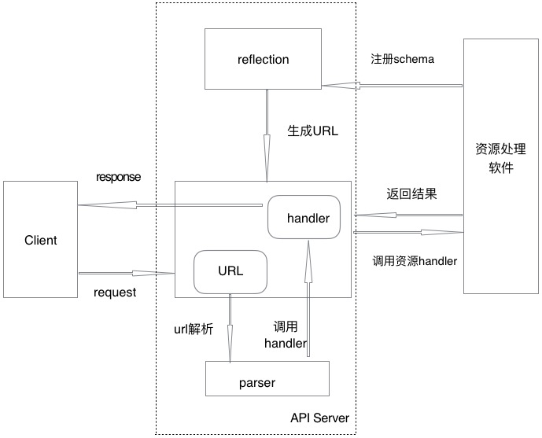

rest api
======
# 概要
api server 会使用注册的资源schema及schema之间父子关系，自动生成url并监听，资源schema包含字段属性定义和rest请求对应的handler函数调用，当收到client的url请求后，api server 解析url并定位资源，检查资源字段有效性，并调用相应的资源handler函数处理，最后将返回结果应答给client。

# 架构

# 详细设计
*  资源定义
	* api server提供object接口，用来设置或获取资源基础属性

			type Object interface {
    			ObjectID
    			ObjectType
    			ObjectLinks
    			ObjectTimestamp
    			ObjectParent
    			ObjectSchema
			}

    * api server 提供Resource基础资源对象，实现Object接口，每个资源的定义必须包含Resource
    
    		type Resource struct {
    			ID                string             
    			Type              string             
    			Links             map[string]string  
    			CreationTimestamp ISOTime            
    			Parent            Object             
    			Schema            *Schema            
			}
	资源定义案例如下：
	
			type Secret struct {
				resttypes.Resource `json:",inline"`
				Name               string       `json:"name"`
			}
   			
	* api server提供Handler接口，完成资源的增删改查操作，资源需实现所支持的操作
	
			type Handler interface {
    			Create(*Context, []byte) (interface{}, *APIError)
    			Delete(*Context) *APIError
    			Update(*Context) (interface{}, *APIError)
    			List(*Context) interface{}
    			Get(*Context) interface{}
    			Action(*Context) (interface{}, *APIError)
			}
    
	* api server提供字段检查，字段检查的json tag为rest，每个属性用逗号分隔

			type Http struct {
			  resttypes.Resource `json:",inline"`
			  Port int `json:"port" rest:"required=false,default=9000"`
			}
  	
  	目前字段检查支持:
  	  * required: 当为true时表示字段是必传字段，如果是空就会报错
  	  * default: 当字段为空时，为其填充该默认值
  	  * options: 当字段为enum类型，有效字段集合定义在options，以 | 分割，如：options=TCP|UDP
  	
  	字段检查逻辑
      * 首先检查字段是否为空，如果为空，且字段属性required＝true，则报错
      * 其次查看字段属性options是否为空，如果不为空，且字段值不在options范围内，则报错
      * 最后如果字段为空，且字段属性default值不为空，将default值赋给该字段   

* schema
  * schema字段定义

		type Schema struct {
    		Version           APIVersion        
    		PluralName        string            
    		ResourceMethods   []string          
    		ResourceFields    map[string]Field  
    		ResourceActions   []Action          
    		CollectionMethods []string          
    		CollectionFields  map[string]Field 
    		CollectionActions []Action         

    		StructVal reflect.Value 
    		Handler   Handler		
    		Parents   []string
		}
  其中StructVal为资源结构体定义的反射值，Handler为资源实现具体操作的接口，Parents为资源的父资源，一个资源可以有多个父资源
  * 注册schema函数
  
		MustImportAndCustomize(version *APIVersion, obj interface{}, handler Handler, f func(*Schema, Handler), externalOverrides ...interface{})
  其中入参 f 为自定义函数，用来设置schema的Handler、Parents、ResourceMethods、ResourceActions、CollectionMethods等字段

* URL生成
  * 资源URL由groupPrefix、apiversion和资源父子关系组成, 目前支持的groupPrefix只有/apis， apiversion包含group和version两个字段，group目前只支持zcloud.cn，version为v1
  * 如果资源是顶级资源，没有父资源，如cluster，自动生成URL为 /apis/zcloud.cn/v1/clusters
  * 如果资源只有一个父资源，如namespace父资源为cluster，那么自动生成URL为 /apis/zcloud.cn/v1/clusters/cluster_id/namespaces
  * 如果资源有多个父资源，那么会自动生成多个URL， 如pod父资源有deployment、daemonset、statefulset，自动生成的URL为：
    /apis/zcloud.cn/v1/clusters/cluster_id/namespaces/namespace_id/deployments/deployment_id/pods
    /apis/zcloud.cn/v1/clusters/cluster_id/namespaces/namespace_id/daemonsets/daemonset_id/pods
    /apis/zcloud.cn/v1/clusters/cluster_id/namespaces/namespace_id/statefulsets/statefulset_id/pods
  
* Links
  * 资源注册schema到api server，操作资源时response会有links字段返回，方便client快捷使用，如statefulset的id为sts123的资源links如下

		{
			"links": {
        		"collection": "http://127.0.0.1:1234/apis/zcloud.cn/v1/clusters/beijing/namespaces/default/statefulsets",
        		"pods": "http://127.0.0.1:1234/apis/zcloud.cn/v1/clusters/beijing/namespaces/default/statefulsets/sts123/pods",
        		"remove": "http://127.0.0.1:1234/apis/zcloud.cn/v1/clusters/beijing/namespaces/default/statefulsets/sts123",
        		"self": "http://127.0.0.1:1234/apis/zcloud.cn/v1/clusters/beijing/namespaces/default/statefulsets/sts123",
        		"update": "http://127.0.0.1:1234/apis/zcloud.cn/v1/clusters/beijing/namespaces/default/statefulsets/sts123"
    		}
    	} 
   
  * links说明如下  		
    * 如果资源支持单个资源的get，即资源schema的ResourceMethods中设置了GET，links中就会包含self
    * 如果资源支持所有资源的list， 即资源schema的CollectionMethods中设置了GET，links中就会包含collection
    * 如果资源支持删除操作，即资源schema的ResourceMethods中设置了DELETE，links中就会包含remove
    * 如果资源支持更新操作，即资源schema的ResourceMethods中设置了PUT，links中就会包含update
    * 如果资源有子资源，如statefulset的是pod父资源，links中会包含pod的collection，即pods
    
# 未来工作
* 添加更多的字段属性检查