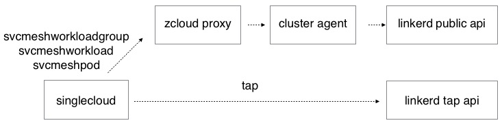
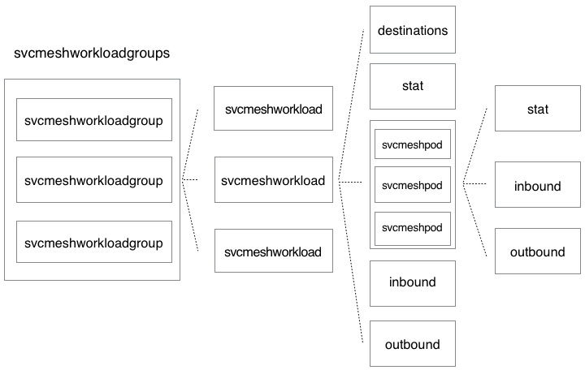

# 服务网格
## 概要
singlecloud集成linkerd资源调用接口，通过cluster agent从linkerd public api获取资源流量统计信息stat，以及出（outbound）和入（inbound）流量信息，通过linkerd tap api获取实时流量信息

## 架构

## 详细设计
### 服务网格资源
#### 资源关系及属性
服务网格资源包含svcmeshworkloadgroup、svcmeshworkload、svcmeshpod，资源之间的关系及属性如下：

* svcmeshworkload的destinations为该workload流量下一跳的workload数组，只有获取svcmeshworkloadgroups才返回
* 流量统计信息stat中Resource为stat所属的资源，TimeWindow为统计时长, Status为pod状态，MeshedPodCount为被linkerd injected的pod个数
* inbound/outbound为stat数组，为入／出该资源的的所有资源的Stat 
* 获取svcmeshworkload时，svcmeshpod信息中只返回stat

#### svcmeshworkloadgroup
* svcmeshworkloadgroup是namespace下的子资源，只支持list
* svcmeshworkloadgroup是表示workload之间有流量的svcmeshworkload数组，workload支持类型为deployment、daemonset、statefulset
* 通过每个svcmeshworkload的destinations（下一跳workload的数组），可以知道每个workload的流量下一跳workload是哪些
* 业务逻辑
  * cluster agent 初始化 
    * cluster agent启动后，获取所有被linkerd injected的pods，根据不同namespace，保存其pods和workload对应关系
    * cluster agent也会监控 namesapce、workload、pod，根据变化更新保存的pods和workload对应关系
  * 当singlecloud收到list svcmeshworkloadgroup的命令，通过proxy向cluster agent获取svcmeshworkloadgroup信息
    * 检查内存中namespace下是否有pods和workload对应关系，没有则直接返回
    * 获取namespace下所有pods的edges信息，edge信息是记录有流量的一对pods，即源pod和目的pod信息
    * 根据pods的edges信息，以及pods与workload对应关系，使用图算法计算出有流量关系的所有workload的图，然后获取图中所有workload的流量统计信息stat
    * 每个svcmeshworkload的id为workload前缀加workload名字，svcmeshworkloadgroup的id为随机生成的uuid
      * deployment前缀： dpm-
      * daemonset前缀： dms-
      * statefulset前缀： sts-
  * cluster agent将获取到的信息返回给singlecloud，由singlecloud将结果返回给请求端

#### svcmeshworkload
* svcmeshworkload为svcmeshworkloadgroup的子资源，只支持get
* svcmeshworkload返回字段包含
  * workload流量统计信息stat
  * 所有入workload的流量统计信息inbound（stat数组）
  * 所有出workload的流量统计信息outbound （stat数组）
  * workload所有pod的流量统计信息svcmeshpod数组，每个svcmeshpod只返回该pod的stat信息
* 业务逻辑
  * singlecloud收到get svcmeshworkload的命令，通过proxy向cluster agent获取svcmeshworkload信息 
    * 根据workload id可以获取到workload的类型和名字，如果id中不包含workload有效前缀则报错
    * 查看内存中namespace是否存在
    * 检查namespace下workload是否存在workload与pods的对应关系，没有则workload不存在
    * 获取workload的流量统计信息stat、inbound、outbound以及workload所有pod的流量统计信息
    * pod的流量统计信息保存在svcmeshpod的stat中，svcmeshpod的id为pod名字
  * cluster agent将获取到的信息返回给singlecloud，由singlecloud将结果返回给请求端

#### svcmeshpod
* svcmeshpod为svcmeshworkload的子资源，只支持get
* svcmeshpod返回字段包含
  * pod流量统计信息stat
  * 所有入pod的流量统计信息inbound（stat数组）
  * 所有出pod的流量统计信息outbound （stat数组）
* 业务逻辑
  * singlecloud收到get svcmeshpod的命令，通过proxy向cluster agent获取svcmeshpod信息 
    * 查看内存中namespace是否存在
    * 检查namespace下workload是否存在workload与pods的对应关系，没有则workload不存在
    * 检查内存中pod是否有对应的workload，没有则pod不存在，如果有，且pod对应workload和请求的workload不一致，则报错
    * 获取pod的流量统计信息stat、inbound 以及 outbound
  * cluster agent将获取到的信息返回给singlecloud，由singlecloud将结果返回给请求端

### 实时流量资源
#### tap
* tap为namespace下的子资源，只支持get
* 请求端通过websocket与singlecloud通信，获取tap信息
* singlecloud直接从linkerd的tap.linkerd.io/v1alpha1的api server获取tap信息
* tap需要的参数通过url的filter中获取, resource_type和resource_name为必传字段，resource_type和to_resource_type只支持deployment、daemonset、statefulset、pod，method只支持POST、PUT、GET、DELETE
  * resource_type 
  * resource_name 
  * to_resource_type
  * to_resource_name
  * method
  * path
* 当所传参数没有to_resource_type和to_resource_name，获取该资源所有出入的实时流量信息
* 当所传参数有to_resource_type和to_resource_name，获取从resource_type/resource_name到to_resource_type/to_resource_name的实时流量信息