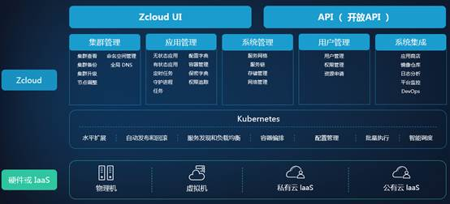
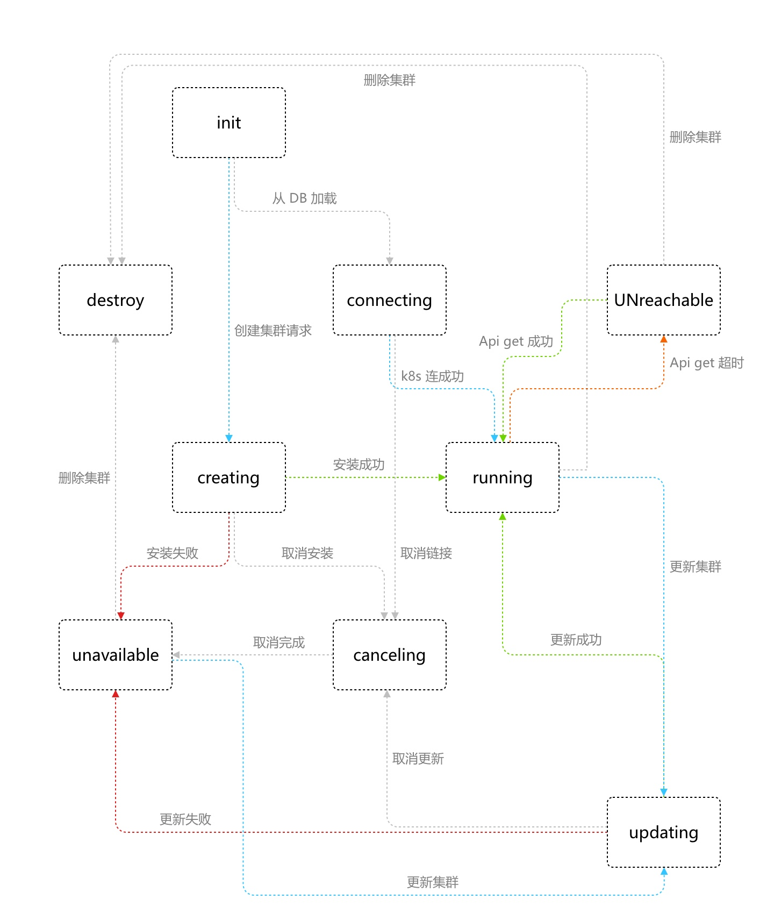

# 1      文档介绍

## 1.1         文档的目的

此文档是提供用于软件开发部门和产品设计部门、产品测试部门之间就此产品的需求分析、产品开发、产品设计、测试方案交流的基础；

## 1.2         参考文档

| **序号** | **文档名称** | **作者** | **来源**                                                     |
| -------- | ------------ | -------- | ------------------------------------------------------------ |
| 1        | 产品原型     | 王少帅   | https://lanhuapp.com/web/#/item/project/product?pid=ae53d49b-3634-4b45-86c5-602306d459b9&docId=39f5c399-104a-4781-983a-0f34a7e0d50f&docType=axure&pageId=6190da3959c241c5ba311eea7a3bd897&image_id=39f5c399-104a-4781-983a-0f34a7e0d50f |
| 2        | 产品设计     | 关倩     | https://lanhuapp.com/web/#/item/project/board?pid=ae53d49b-3634-4b45-86c5-602306d459b9&docId=39f5c399-104a-4781-983a-0f34a7e0d50f&docType=axure&pageId=6190da3959c241c5ba311eea7a3bd897&image_id=39f5c399-104a-4781-983a-0f34a7e0d50f |

 

 

## 1.3         产品命名规范

| **产品名称Zcloud** |          |      |
| ------------------ | -------- | ---- |
| 中文名称           | 英文名称 | 备注 |
|                    |          |      |
|                    |          |      |

 

# 2      产品介绍

## 2.1         产品概要说明

Zcloud是基于容器技术的企业级云平台解决方案。结合Kubernetes对企业的物理机、虚机等资源进行统一管理。对企业的应用做统一调度。保证企业的IT系统或门户网站实现高可用、可扩展、易于发布等特性。

结构图如下：

| **序号** | **功能名称** | **概述**                                                     |
| -------- | ------------ | ------------------------------------------------------------ |
| **1**    | **总览**     | 列出平台所有纳管的集群，并可删除和创建集群，查看集群的资源使用情况。 |
| **2**    | **集群管理** | 当前集群概览，维护集群节点，使用命名空间对用户使用资源进行隔离。 |
| **3**    | **应用管理** | Zcloud平台workload，进行Deployment，Statefulset，Deamonset，Cronjob，Job，应用配置等进行管理。 |
| **4**    | **系统管理** | 对Zcloud平台的存储、网络、服务进行管理与展示。               |
| **5**    | **用户管理** | Zcloud平台的用户管理，权限管理。                             |
| **6**    | **系统集群** | 包含helm应用模版，镜像的registery，ELK，监控，DevOps功能。   |

 

## 2.2         产品用户定位

此产品面向的主要是两类人员。一类是面向系统的运维人员，另一类是面向开发人员。因产品所包含的知识面非常广，同时也很专业，所以产品设计和实现时尽量给予简单的界面和完备的帮助，并对重要功能的业务权限要集中、重点控制。

 

## 2.3         产品中的角色

| **角色名称** | **职责描述**                                                 | **使用的功能**                   | **权限等级** |
| ------------ | ------------------------------------------------------------ | -------------------------------- | ------------ |
| 系统管理员   | 对权限进行划分，管理后台用户，对用户进行资源分配，维护基础资源可用。 | 全部                             | 1            |
| 普通用户     | 对权限内的资源有使用权。可维护自行创建的服务等。             | 只能使用指定namespaces下的资源。 | 2            |

 

# 3      产品总体业务流程图

管理员：

 

 

 

 

 

普通用户：

 

 

 

 

 

 

 

# 4      产品功能结构图

 

| **功能** | **子功能（栏目）**              | **功能点**                                                   | **优先级** |
| -------- | ------------------------------- | ------------------------------------------------------------ | ---------- |
| 导航栏   | -                               | 菜单导航收缩  菜单导航 集群选择 命名空间选择 集群命令行 通知 帮助 用户功能列表 集群事件 |            |
| 总览     | -                               | 集群列表    创建集群    删除集群    进入集群命令行    重新安装部署集群 |            |
| 集群管理 | 1、概览                         | 展示集群名称、版本、节点数、创建日期    展示集群资源使用CPU、MEM、POD |            |
|          | 2、命名空间                     | 命名空间列表    命名空间新建、删除、编辑    命名空间详情    命名空间配额 |            |
|          | 3、节点                         | 节点列表，名称，状态，k8s版本，容器版本，CPU，MEM，POD    节点添加，主机名，IP，角色    节点删除    节点详情 |            |
| 应用管理 | 1、无状态应用   （deployment）  | 应用列表    应用删除    应用新建，可选创建svc或ingress，添加存储，添加环境变量，    应用详情，增加副本数 |            |
|          | 2、有状态应用   （statefulset） | 应用列表    应用删除    应用新建，可选创建svc或ingress，添加存储，添加环境变量，    应用详情，增加副本数 |            |
|          | 3、守护进程集   （deamonset）   | 应用列表    应用删除    应用新建，可选创建svc或ingress，添加存储，添加环境变量，    应用详情 |            |
|          | 4、定时任务   （cronjob）       | 任务列表    任务删除    任务新建，执行时间设定重启策略，添加存储，添加环境变量，    任务详情 |            |
|          | 5、任务   （job）               | 任务列表    任务删除    任务新建，添加存储，添加环境变量，    任务详情 |            |
|          | 6、配置字典   （configmap）     | 字典列表    字典删除    字典编辑    字典新建，可添加多个配置文件 |            |
|          | 7、保密字典   （secret）        | 字典列表    字典删除    字典编辑    字典新建，key-value形式 |            |
| 系统管理 | 1、存储                         | 存储列表    存储新建    存储编辑                     |            |
|          | 2、网络                         | POD IP使用    服务IP使用                                 |            |
|          | 3、服务链                       | 对外服务资源    对内服务资源                             |            |
| 资源申请 | 1、资源申请列表                 | 资源申请新建    资源申请详情    资源申请删除    资源申请审批 |            |
| 应用商店 | 1、应用模版                     | 本地加载  展示                                           |            |
|          | 2、应用                         | 创建  查看  删除                                     |            |

 

 

# 5      功能需求

## 5.1         导航栏

### **5.1.1**    功能原型

*参见1.2* *参考文档*

### **5.1.2**    功能概述

对全局性的功能进行操作，包含菜单导航收缩、菜单导航、集群选择、命名空间选择、集群命令行、通知、帮助、用户功能列表。

### **5.1.3**    功能(业务)流程图

无

### **5.1.4**    功能点清单

| **功能** | **子功能（栏目）** | **功能点描述**       |
| -------- | ------------------ | -------------------- |
| 导航栏   | 导航收缩           | 导航栏收缩           |
|          | 菜单导航           | 总览                 |
|          |                    | 集群管理             |
|          |                    | 应用管理             |
|          |                    | 系统管理             |
|          |                    | 资源申请             |
|          | 集群选择           | 选择要操作的集群     |
|          | 命名空间选择       | 选择要操作的命名空间 |
|          | 集群命令行         | 打开终端模式         |
|          | 通知               | 一些系统消息         |
|          | 帮助               | 平台的使用手册       |
|          | 用户功能列表       | 用户相关功能         |

 

### **5.1.5**    功能详细描述

导航栏收缩：控制导航栏收起或展开，收起时只留图标，展示开显示图标加文字。

菜单导航：这里只包含两种逻辑，没有选择集群和已选择集群。当没有选择集群时，只显示总览与资源申请。当选择集群后，要显示所有菜单。

集群选择：下拉菜单，列出该用户权限内的所有集群。

命名空间选择：下拉菜单，列出该用户权限内的所有命名空间。

集群命令行：只有选择集群后，此按钮才可用。为了方便用户在任何操作页面可以随时进入集群命令行设计。

通知：zcloud产生的通知，为集群产行的告警等消息。

帮助：zcloud使用帮助手册。

用户功能：用户编辑、用户详情、修改密码、用户列表、注销。

### **5.1.6**    业务数据描述

1、角色信息（角色名称、角色描述）

角色名称：20个英文字符

角色描述：50个中文字符

角色权限：复选框选择

 

2、用户信息（用户名、备注、集群权限）

 

​    用户名： 由字母a～z(不区分大小写)、数字0～9、点、减号或下划线组成。只能以数字或字母开头和结尾 用户名长度为4～20个字符。

​    登陆密码：6到16个字符。机器生成

 

## 5.2         总览

### **5.2.1**    原型

*参见原型地址。*

### **5.2.2**    功能概述

展示所有已被zcloud纳管的集群列表。

 

### **5.2.3**    功能点清单

| **功能** | **子功能（栏目）** | **功能点描述**                                               |
| -------- | ------------------ | ------------------------------------------------------------ |
| 总览     | -                  | 集群列表    创建集群    删除集群                     |
|          | 集群操作           | 集群命令行    取消操作    安装日志  添加节点 删除节点 |

 

### **5.2.4**    功能详细描述

#### **5.2.4.1**      集群列表

**功能点描述：** 对zcloud已纳管的集群做概要的信息展示。

**使用角色：** 管理员。

具体展示字段，集群状态、集群名称、节点数、CPU使用与总量、内存使用与总量（单位放在表头）、容器数使用与总容量、kubernetes版本、操作（命令行、重新部署、删除、查看安装日志、编辑）

可通过集群名称进行搜索过滤。

集群整个生命周期内，所有状态的转换关系图。

#### **5.2.4.2**      创建集群

**功能点描述：** 进行集群的创建。

创建参数如下：

集群属性设置：集群名称，集群域名后缀。

Zke设置：zcloud服务IP，zcloud服务端口。

SSH设置：用户名，ssh私钥文件，ssh连接端口。

集群网络设置：服务IP段，POD IP段，flannel或是calico，集群内部DNS IP，转发DNS IP。

私有仓库设置：URL，CA证书，用户名，密码。

添加节点设置：主机名，IP，角色（master和etcd与其它角色互斥）

**使用角色：** 管理员。

**描述**

创建集群时，集群状态初始为creating，若创建成功（zcloud可正常访问api server），则集群状态变为running。若失败，集群状态为unavailable。

#### **5.2.4.3**      删除集群

**功能点描述：** 对集群进行删除操作。

**使用角色：** 管理员。

删除只是把zcloud的集群记录删除，k8s方面不做任何清理。

集群删除：在unreachable，running，unavailable状态下可以操作删除集群。

#### **5.2.4.4**      集群操作

**功能点描述：** 对集群进行管理操作。

**使用角色：** 管理员。

在集群管理功能中，用户可以对集群的状态进行管理，在创建中、更新中、连接中状态可以进行终止操作。并且可以查看集群的属性字段。可以对集群的节点进行添加或删除的操作。

各种状态下，可进行的操作如下：

运行中：命令行-可使用，停止与日志不可使用

不可用：命令行、停止与日志不可使用

更新中：命令行不可使用、停止与日志可用

连接中：命令行不可全叻、停止可用，日志不可使用

创建中：命令行不可使用、停止与日志可用

不可达：命令行、停止与日志不可使用

#### **5.2.4.5**      删除节点

**功能点描述：**  删除集群节点。

删除节点：支持批量删除

**使用角色：** 管理员。

**描述**

删除节点实际上是对集群的update操作，当节点变动时，集群状态会有两种结果running - updating - running成功，这时查看节点数会相应的减少。running - updating -unavailable失败。在etcd良好运行的情况下，删除操作不会失败。

running与unavailable状态的集群才允许做删除节点。

若集群只剩余一个master节点，则不允许删除master节点；

若集群只剩余一个etcd节点，则不允许删除etcd节点；

若集群只剩余一个worker节点，则不允许删除workder节点；

若想要做节点角色的变更，需要先删除该节点，再加入该节点时，进行角色的选择。

#### **5.2.4.6**      添加节点

**功能点描述：** 添加集群节点。

添加节点设置：主机名，IP，角色（master和etcd与其它角色互斥）

**使用角色：** 管理员。

**描述**

添加节点实际上是对集群的update操作，当节点变动时，集群状态会有两种结果running - updating - running成功，这时查看节点数会相应的减少。running - updating -unavailable失败。如果发生失败，添加的节点信息保存在集群配置里。并且节点数量不会变。

#### **5.2.4.7**      进入集群命令行

**功能点描述：** 进入集群的命令行，进行信息的查看操作。

**使用角色：** 所有具有该集群权限的用户

**描述**

只有running状态下的集群才可用，进入命令行后，用户只有只读权限。

#### **5.2.4.8**      终止操作

**功能点描述：** 对集群的创建或更新动作进行取消。

**使用角色：** 管理员。

**描述**

creating，updating，connecting状态可进行取消操作。

#### **5.2.4.8**      查看创建或更新日志

**功能点描述：** 查看创建或更新日志

**使用角色：** 管理员。

**描述**

仅creating和updating状态可查看创建/更新日志。日志缓存50条。当创建或更新失败或完成后，日志功能不可用。

 

### **5.2.5**    业务数据描述

1、新建集群信息

集群名称：20位中文字符或英文字符

## 5.3         集群管理

### **5.3.1**    功能原型

*参见原型地址。*

### **5.3.2**    功能概述

对集群的资源使用和基本信息进行展示，维护集群的节点资源与命名空间资源。

 

### **5.3.3**    功能点清单

| **功能** | **子功能（栏目）** | **功能点描述**                                               |
| -------- | ------------------ | ------------------------------------------------------------ |
| 集群管理 | 1、概览            | 展示集群名称、版本、节点数、创建日期    展示集群资源使用CPU、MEM、POD |
|          | 2、命名空间        | 命名空间列表    命名空间新建、删除、编辑    命名空间详情    命名空间配额 |
|          | 3、节点            | 节点列表，名称，状态，k8s版本，容器版本，CPU，MEM，POD    节点添加，主机名，IP，角色    节点删除    节点详情 |

 

### **5.3.4**    功能详细描述

#### **5.3.4.1**      概览

 

 

#### **5.3.4.2**      命名空间

 

 

#### **5.3.4.3**      节点

 

### **5.3.5**    业务数据描述

命名空间名称：

 

 

 

## 5.4         应用管理

### **5.4.1**    功能原型

*参见原型地址*

### **5.4.2**    功能概述

对集群的workload进行管理，无状态应用（deployment）、有状态应用（statefulset）、守护进程集（deamonset）、定时任务（cronjob）、任务（job）、配置字典（configmap）、保密字典（secret）。

 

 

 

 

### **5.4.3**    功能点清单

|          | **功能**                        | **子功能（栏目）**                                           | **功能点描述** |
| -------- | ------------------------------- | ------------------------------------------------------------ | -------------- |
| 应用管理 | 1、无状态应用   （deployment）  | 应用列表    应用删除    应用新建，可选创建svc或ingress，添加存储，添加环境变量，    应用详情，增加副本数 |                |
|          | 2、有状态应用   （statefulset） | 应用列表    应用删除    应用新建，可选创建svc或ingress，添加存储，添加环境变量，    应用详情，增加副本数 |                |
|          | 3、守护进程集   （deamonset）   | 应用列表    应用删除    应用新建，可选创建svc或ingress，添加存储，添加环境变量，    应用详情 |                |
|          | 4、定时任务   （cronjob）       | 任务列表    任务删除    任务新建，执行时间设定重启策略，添加存储，添加环境变量，    任务详情 |                |
|          | 5、任务   （job）               | 任务列表    任务删除    任务新建，添加存储，添加环境变量，    任务详情 |                |
|          | 6、配置字典   （configmap）     | 字典列表    字典删除    字典编辑    字典新建，可添加多个配置文件 |                |
|          | 7、保密字典   （secret）        | 字典列表    字典删除    字典编辑    字典新建，key-value形式 |                |

 

### **5.4.4**    子功能详细描述

#### **5.4.4.1**      无状态应用

 

#### **5.4.4.2**      有状态应用

 

#### **5.4.4.3**      守护进程集

#### **5.4.4.4**      定时任务

#### **5.4.4.5**      任务

#### **5.4.4.6**      配置字典

#### **5.4.4.7**      保密字典

 

### **5.4.5**    业务数据描述

## 5.5      heml chart

### **5.5.1**    功能原型

*参见原型地址*

### **5.5.2**    功能概述

​		Helm 是 Kubernetes 生态系统中的一个软件包管理工具。而Chart是helm管理应用的打包格式，一个chart对应一个或一套应用。内部是一系列的yaml描述文件，以及为yaml 服务的文件。很多的chart聚集在一起，对于用户就是一个一个的应用模版，用户可以使用这些模版快速的部署应用服务。

​		此功能涉及的资源类型：

* chart资源：chart资源提供chart的信息展示，配置展示等。在chart的详情页面可以进行app资源的创建。

* app资源：包含一个或多个k8s资源。需要在指定的namespaces进行创建。

此功能操作的范围：chart资源查看可以在全局状态下进行查看，app资源的安装和卸载只能在namespaces下操作。

​		chart资源没有父资源，也没有子资源。chart本身是独立的。

​		app资源的父资源是namespaces，如果删除namespaces，app资源也需要一起删除。app资源包含k8s的资源为引用关系。若app资源删除，在业务逻辑上，需要删除相关引用的k8s资源。

 

### **5.5.3**    功能点清单

|      | **功能**     | **子功能**                | **功能点描述** |
| ---- | ------------ | ------------------------- | -------------- |
|      | 1、chart资源 | 本地加载 展示         |                |
|      | 2、app资源   | 创建 展示    删除 |                |

### **5.5.4**    子功能详细描述

#### **5.5.4.1**  本地加载

​		chart资源部署在本地，Zcloud启动时，是把chart资源加载到内存，还是每一个URL请求时实时在本地获取，开发自行定义。

#### **5.5.4.2**  charts展示

​		当访问Zcloud UI时，对chart资源列表进行展示， 展示内容：icon，chart名称，描述，详情按钮。

#### **5.5.4.3**  创建

* 当创建app资源时，需要根据app资源预设的属性进行设置后，再进行创建。
* 因我们规定，app资源的创建必须在指定的namespaces下进行，所以需要对chart进行检测，不允许chart进行namespaces的创建操作。
* 同一个chart资源，在同一个namespaces下，可以允许app资源多次创建，需要指定不同的k8s资源名称。
* 当app资源需要使用存储时，不必须开放pv与pvc的配置，让用户添加存储名称，类型，大小即可。pv与pvc在Zcloud帮助用户进行创建。

#### **5.5.4.4**  app资源展示

对已创建的app资源进行展示，并且可以按来源chart进行分组，清晰的定义哪些app资源是从同一个chart进行创建的，这里不需要细化到版本，只细化到chart的名称即可。

* app资源展示的概要内容如下：icon，app资源名称，版本号；

* 可进行的操作如下：升级、降级、删除。

​        对于app资源，需要接口返回app资源里引用的k8s资源。对于k8s资源的修改，目前不再单独做。先跳转到已有的应用管理进行修改。减少代码工作量。app资源详情页中，k8s资源只返回name，kind，link

​        对于k8s资源，目前只显示deployment、statefulset、daemonset，cronjob，job，config map，secret，svc，ingress，不显示pvc，pv，serviceaccount，clusterrole，clusterrolebingd，networkpolicy。

​		svc，ingress，与deployment等关系先不做保存。

#### **5.5.4.5**  删除

​		支持一键删除已安装的app资源。删除app资源时，其所有引用的k8s资源全部要关联删除。如果app资源所有的namespaces被删除，那么app资源也要被删除。

​		

### **5.5.5**    业务数据描述

 

## 5.6         系统管理

### **5.6.1**    功能概述

 

### **5.6.2**    功能点清单

| **功能** | **子功能（栏目）** | **功能点描述**                           |
| -------- | ------------------ | ---------------------------------------- |
| 系统管理 | 1、存储            | 存储列表    存储新建    存储编辑 |
|          | 2、网络            | POD IP使用    服务IP使用             |
|          | 3、服务链          | 对外服务资源    对内服务资源         |

 

### **5.6.3**    功能详细描述

#### **5.6.3.1**      存储

 

#### **5.6.3.2**      网络

#### **5.6.3.3**      服务链

 

### **5.6.4**    业务数据描述

 

## 5.7         资源申请

### **5.7.1**    功能概述

 

### **5.7.2**    功能点清单

| **功能** | **子功能（栏目）** | **功能点描述**                                               |
| -------- | ------------------ | ------------------------------------------------------------ |
| 系统管理 | 1、资源申请列表    | 资源申请新建    资源申请详情    资源申请删除    资源申请审批 |

 

### **5.7.3**    功能详细描述

#### **5.7.3.1**      资源申请新建

**功能点描述：** 对zcloud已纳管的集群做概要的信息展示。

**使用角色：** 普通用户。

资源申请新建时，在用户添写命名空间后添加6个字符的sha256(username)值，开始的6个字符。例如web-7a49bc。中间需要添加中划线分隔。

#### **5.7.3.1**      资源申请详情

**功能点描述：** 对zcloud已纳管的集群做概要的信息展示。

**使用角色：** 普通用户。

资源申请新建时，在用户添写命名空间后添加6个字符的sha256(username)值，开始的6个字符。例如web-7a49bc。中间需要添加中划线分隔。

#### **5.7.3.1**      资源申请删除

**功能点描述：** 对zcloud已纳管的集群做概要的信息展示。

**使用角色：** 普通用户。

资源申请新建时，在用户添写命名空间后添加6个字符的sha256(username)值，开始的6个字符。例如web-7a49bc。中间需要添加中划线分隔。

#### **5.7.3.1**      资源申请审批

**功能点描述：** 对zcloud已纳管的集群做概要的信息展示。

**使用角色：** 普通用户。

资源申请新建时，在用户添写命名空间后添加6个字符的sha256(username)值，开始的6个字符。例如web-7a49bc。中间需要添加中划线分隔。

### **5.7.4**    业务数据描述

 

# 6      非功能性需求

## 6.1界面操作需求

整体风格保持一致，功能操作使用按钮，操作在同一界面上完成。

兼容800X600以及以上各分辨率。

## 6.2性能需求

同时支持50个集群的管理，单集群支持1000个节点。

## 6.3安全性需求

高级管理员与普通用户以权限划分不同的操作资源。

## 6.4维护与升级

## 6.5可靠性和健壮性

## 6.6用户文档需求

## 6.7运行环境

浏览器Firfox、chrome

 

 

 

 

 
