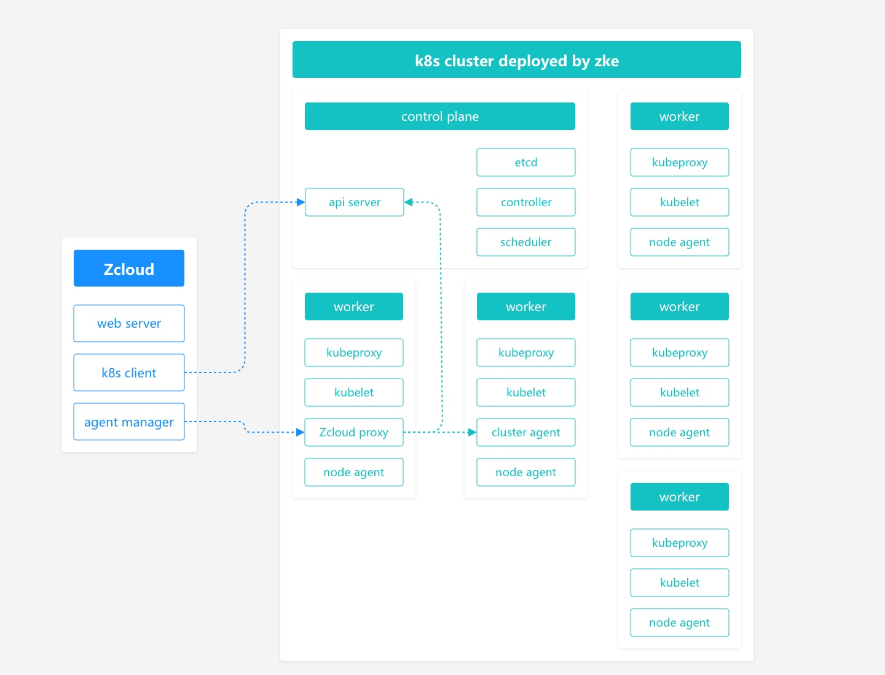

# 产品功能

Zcloud作为企业级的全栈化容器管理平台，为用户提供了一个具备极致体验的 Web 控制台，让您能够像使用任何其他互联网产品一样，快速上手各项功能与服务。Zcloud目前提供了集群管理、容器管理、应用商店、应用管理、基础资源管理、资源申请、镜像仓库、监控中心等功能模块，并开发了自己的存储与网络方案。支持对接多种开源的存储与网络方案，支持高性能的商业存储与网络服务。以下从专业的角度为您详解各个模块的功能服务：

## 全局

通过简易的UI操作，支持多集群管理，包括集群创建、集群删除、节点添加、节点删除、集群命令行等操作。并在全局配置中支持镜像仓库的设置。支持裸金属服务器、虚拟机快速部署高可用集群，支持多云、混合云集群

## 集群管理

对指定集群进行相关的资源进行管理，包括集群使用资源查看，命名空间查看，节点信息查看，网络使用信息查看。对集群的存储进行管理，比如创建存储，存储扩缩容。存储支持两种类型，本地存储（LVM），网络存储（CEPH）。

## 容器管理

对集群的容器进行管理，包括容器运行时管理、容器镜像管理。支持Kubernetes关键组件健康检查，比如API Server、kube-proxy、kubelet等。

## 应用商店

支持使用应用模版一键部署应用。支持本地模版与去端模版。

## 应用管理

对使用应用模版部署的应用进行管理，比如应用的删除、更新等操作。同时支持对应用的相关资源进行关系展示。

## 基础资源

对底层 Kubernetes 中的多种类型的资源提供极简的图形化向导式 UI ，其中包括：无状态副本、有状态副本、守护进程、定时任务、任务、服务、服务入口、UDP服务入口、配置字典、保密字典等。

## 资源申请

管理对可以通过普通用户的资源申请，进行整个集群的资源分配管理。方便记录资源与回收资源。

## 用户管理

Zcloud支持多租户，通过对用户的二级管理，实现租户间的资源隔离。通过对普通用户权限的细粒度划分，有效的做到了资源的安全控制。同时支持统一认证登录。

## 镜像仓库

支持用户的私有镜像仓库的搭建，方便用户对镜像进行统一管理，支持安全扫描，解决用户镜像的安全问题。

## 监控中心

实现对用户所有资源的监控与采样分析，从节点，到集群，到命名空间，到kubernetes资源，到POD，到容器的每一层细粒度的监控。

## 技术架构

Zcloud server软件运行在独立的linux服务器上，不建议运行在kubernetes的节点上。下图说明了Zcloud的运行架构。该图描绘了管理一个kubernetes集群的Zcloud。

每个Zcloud server组件的功能如下:

**Zcloud server**

Zcloud server运行在独立的服务器上，它实现了以下功能:

- **Web server**

Zcloud可视化管理WEB UI。提供用户、集群、存储、网络等功能的管理。

- **Agent manager**

实现与kubernetes集群的交互。

**Zcloud proxy**

实现操作集群指令的转发。

**Cluster agent**

实现获取集群的状态等。

