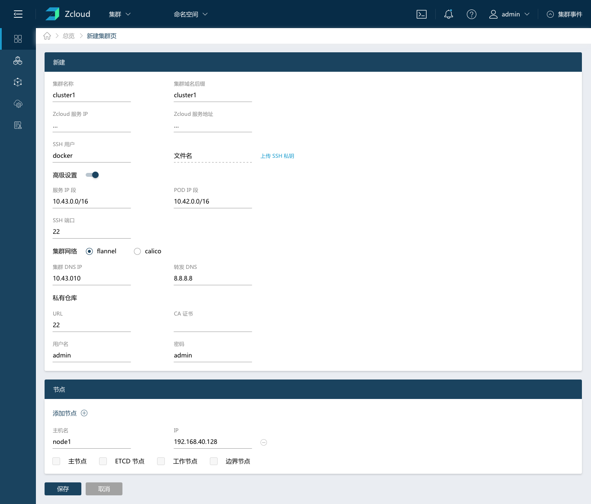

本教程将指导您完成:

- 创建第一个集群；
- 部署一个应用程序，如Nginx；

## 入门须知

- 熟悉Linux基础命令；
- 了解SSH使用方法，了解公钥/私钥工作原理；
- 熟悉Docker基本使用方法及基础命令，比如：容器日志查看；
- 了解负载均衡工作原理(L4/L7)；
- 了解域名解析原理；
- 了解K8S基本概念

## 配置Linux主机

您的主机可以是：

- 云主机
- 本地虚拟机
- 本地物理机

**注意**:在使用云主机时，您需要允许TCP/80和TCP/443入站通信端口。请查阅您的云主机文档以获取有关端口配置的信息。有关端口要求的完整列表，请查阅2.3端口需求。

根据以下要求配置主机:

- Ubuntu 16.04 +(64位)
- Centos/RedHat Linux 7.4+(64位)

Ubuntu操作系统有Desktop和Server版本，选择安装server版本

**硬件需求**：

- CPU: 2C
- 内存: 4GB

**注意**:此配置仅为满足小规模测试环境的最低配置。

**软件需求**：

* 软件: Docker

* 支持的Docker版本:

- - 17.03.x
  - 18.06.x
  - 18.09.x

**注意**:有关Docker安装说明,请访问其[文档](https://docs.docker.com/install/)。软件需求要应用于所有节点。主机的更详细配置说明，请查看2.1 基础环境配置。

## 登录Zcloud

登录并开始使用Zcloud。在地址栏输入http://<IP>:<PORT>/login，用户名admin，密码默认为zdns。

## 创建K8S集群

创建Kubernetes集群，可以使用**自定义**选项。您可以添加云主机、内部虚拟机或物理主机作为集群节点，节点可以运行任何一种或多种主流Linux发行版。

点击保存后，页面会跳转到全局的集群列表页面，可以看到当前集群的状态。

* ETCD集群容错表

建议在ETCD集群中使用奇数个成员,通过添加额外成员可以获得更高的失败容错。具体详情可以查阅[optimal-cluster-size](https://coreos.com/etcd/docs/latest/v2/admin_guide.html#optimal-cluster-size)。

| **集群大小** | **MAJORITY** | **失败容错** |
| ------------ | ------------ | ------------ |
| 1            | 1            | 0            |
| 2            | 2            | 0            |
| 3            | 2            | **1**        |
| 4            | 3            | 1            |
| 5            | 3            | **2**        |
| 6            | 4            | 2            |
| 7            | 4            | **3**        |
| 8            | 5            | 3            |
| 9            | 5            | **4**        |

## 部署Nginx

